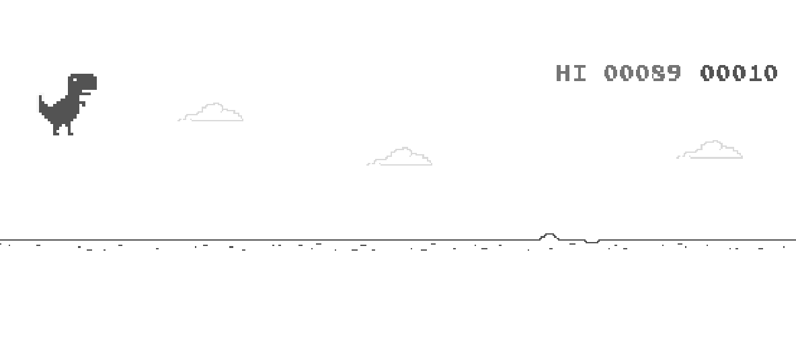

# Chrome Dino Bot Using Deep Q-Learning At Real Time

In this project, I learned:
* How to implement a Deep Q-Learning custom trained
* cv2 library(resize, find edges)
* ActionChains from selenium
* and a little bit more of other things...

I failed at this project, because(disclaimer: This is my vision about what went wrong) I couldn't find a good way to stop the running of the game to let the script calculate the action, this lead to delayed action and poor rewarding. Because of that, my next project will be to build a copy of the chrome dino game using python and using that environment(controllable by me) to train a Deep Q-Learning model.
